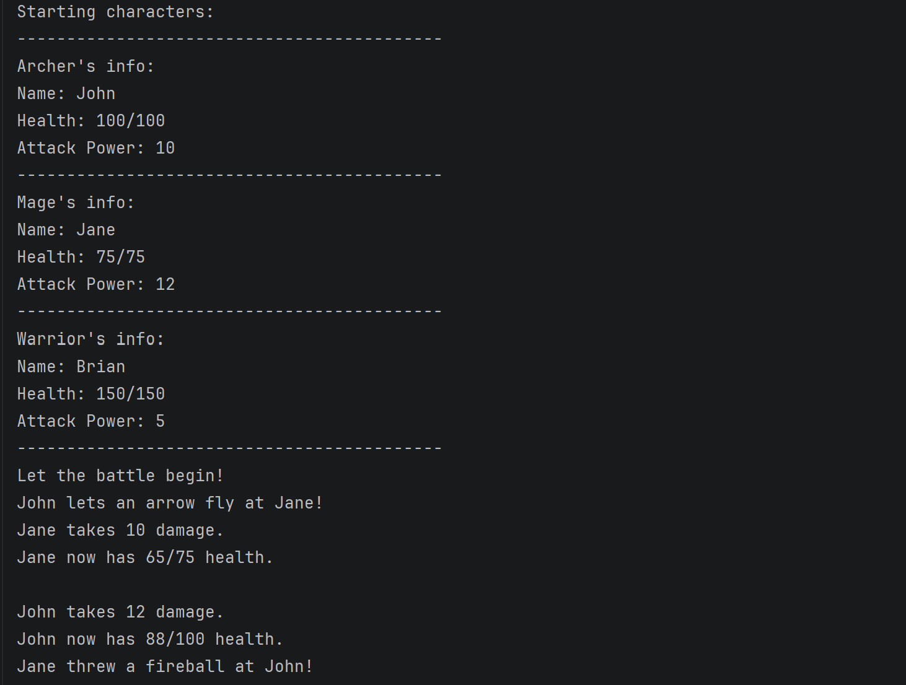

# Game Character Battle System

This is a program that allows the user to create Characters programmatically and then have them fight all within the console.

# How to run

First, build the program into a .jar file, and then use `java -jar GameCharacterBattleSystem.jar`. You can also run the program by cloning this repository and doing `cd GameCharacterBattleSystem/src` and then doing `java EpicBattle.java`.

# In Action

